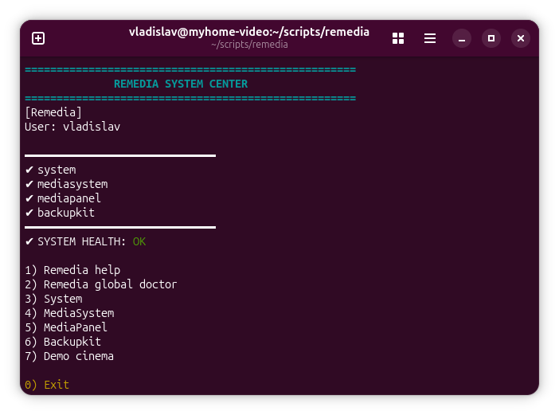
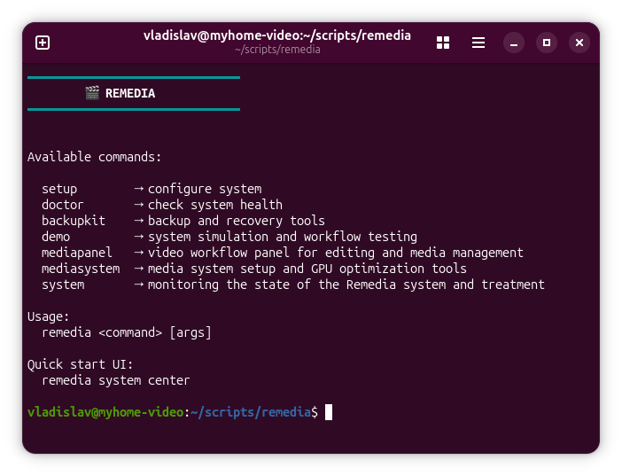
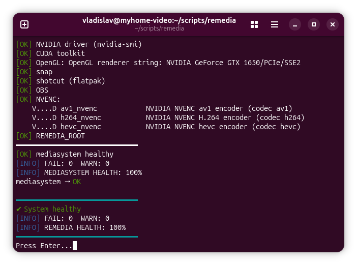
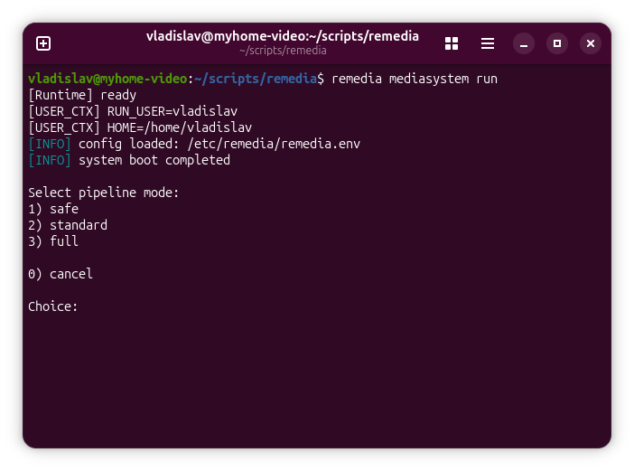
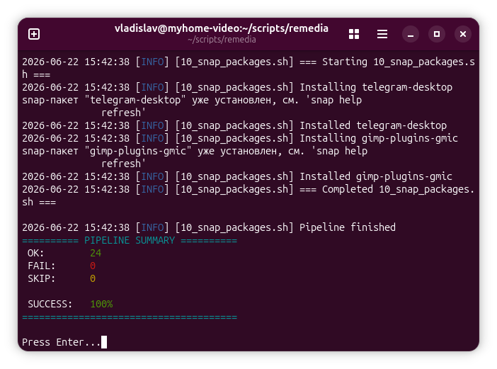
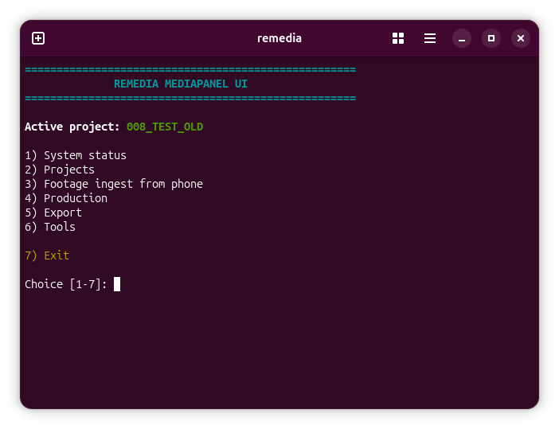
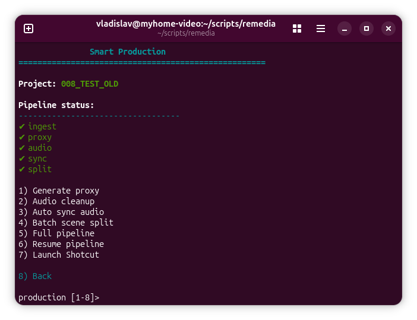
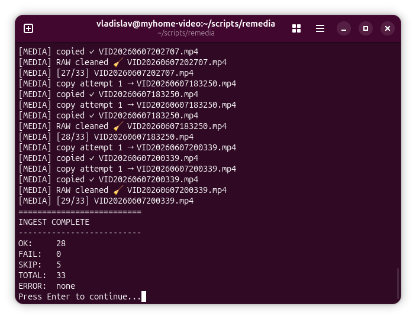

# REMEDIA

[](LICENSE)

[](https://github.com/krashevski/reincarnation-backup-kit)
[](https://github.com/krashevski/reincarnation-backup-kit)

[🇬🇧 English](README.md) | [🇷🇺 Russian](docs/RU/README_RU.md)

**Remedia** is a modular system environment for Debian/Ubuntu, focused on:
* media production
* system recovery
* integrity control
* secure package management
Remedia combines a CLI framework, runtime, registry, and modular architecture into a single engineering system.

## ✨ Main Ideas

Remedia was not created as an abstract tool, but as a response to real-world problems with Linux systems:
* corruption of permissions and ownership
* uncontrolled postinstall scripts
* system contamination after package removal
* lack of secure staging before installation
* difficulty restoring the working environment

The project is evolving towards:
* **transactional system behavior**
* **manifest-driven state**
* **recovery-first architecture**
* **runtime isolation**
* **modular CLI orchestration**

## 🧱 Architecture

Remedia is not just a set of scripts. This is a multi-layered system:
```text
remedia
├── CLI (entrypoint router)
├── Runtime (execution environment)
├── Registry (modules + contracts)
├── Modules
│ ├── system
│ ├── mediasystem
│ ├── mediapanel
│ ├── backupkit
│ └── demo
└── Config (/etc/remedia)
```

## 🚀 Installation

```bash
sudo dpkg -i remedia_1.0.0_all.deb
```

Dependencies:
* bash >= 5.0
* coreutils
Recommended:
* util-linux
* findutils

## 🖥 Usage
### CLI
```bash
remedia
```

### Launch UI
```bash
remedia system center
```

## 🧩 Key Components

### MediaSystem
Pipeline-oriented system for media production.

### MediaPanel
Media environment management and workflow interface.

### BackupKit (Reincarnation)
System for restoring user data and system state.

### System Tools
A set of diagnostic, monitoring, and maintenance tools.

## ⚙️ Configuration

Main config:
```bash
/etc/remedia/remedia.env
```

## 🧠 Manifest Model

Remedia introduces a **manifest-driven system state model**.
Manifest:
* captures the expected state
* is used as a **trust anchor**
* helps recover from system degradation

## 🔍 Remedia Doctor (planned)

Global system diagnostics:
```bash
remedia doctor
```

Example:
```text
dpkg → OK
home → OK
disk → WARN
gpu → SKIPPED

SYSTEM HEALTH: 92%
```

## 🔐 Philosophy

Remedia is a layer between the package and the system.
It adds:
* pre-installation checking
* file system control
* execution isolation
* the ability to analyze packages before application
This brings the system closer to:
* sandbox inspection
* deployment simulation
* reproducible environments

## 🎬 Project Origins

The project grew out of:
* video work (Shotcut)
* the need for a stable environment
* repeated system restores
* accumulated experience with Linux

First came the **Reincarnation Backup Kit**,
then the **Media System** spun off,
and ultimately **Remedia** emerged as a complete system.

## 📜 Contacts and Support

Author: Vladislav Krashevski 📧 v.krashevski@gmail.com
Support: ChatGPT

## 📌 Status

Version: **1.0.0**
The project is in active development:
* contract stabilization
* runtime improvements
* UI development
* implementation of transactional models

## 🧭 Development Directions

* full-fledged staging before package installation
* rollback and snapshot system
* expansion of the doctor subsystem
* development of Media Panel
* improving fault tolerance

## 🤝 Contributions

Currently, the project is being developed by the author.
We plan to open it up to contributors in the future.

## ⚠️ Important

Remedia works with system components. Recommended:
* Use with an understanding of Linux systems
* Test in a safe environment
* Make backups

## 📎 Conclusion

Remedia is an attempt to make the Linux environment:
* Resilient
* Predictable
* Recoverable
* Suitable for long-term operation

Not just "workable," but **survivable and time-resistant**.

## 🖼️ Screenshots

<p align="center"> 
 
 </p> 
<p align="center"> 

 </p> 
<p align="center"> 

 </p> 
<p align="center"> 

 </p> 
